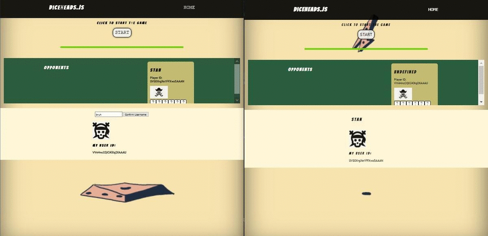
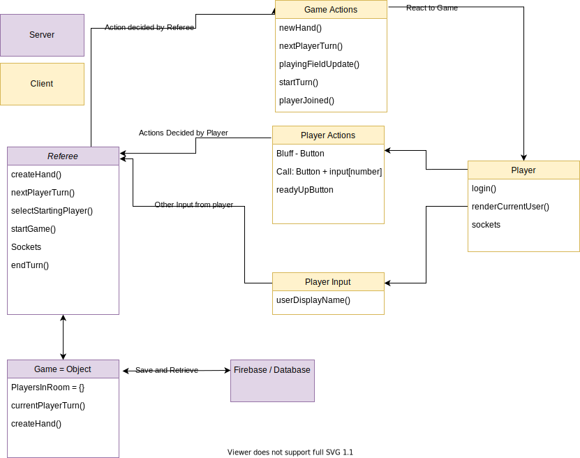
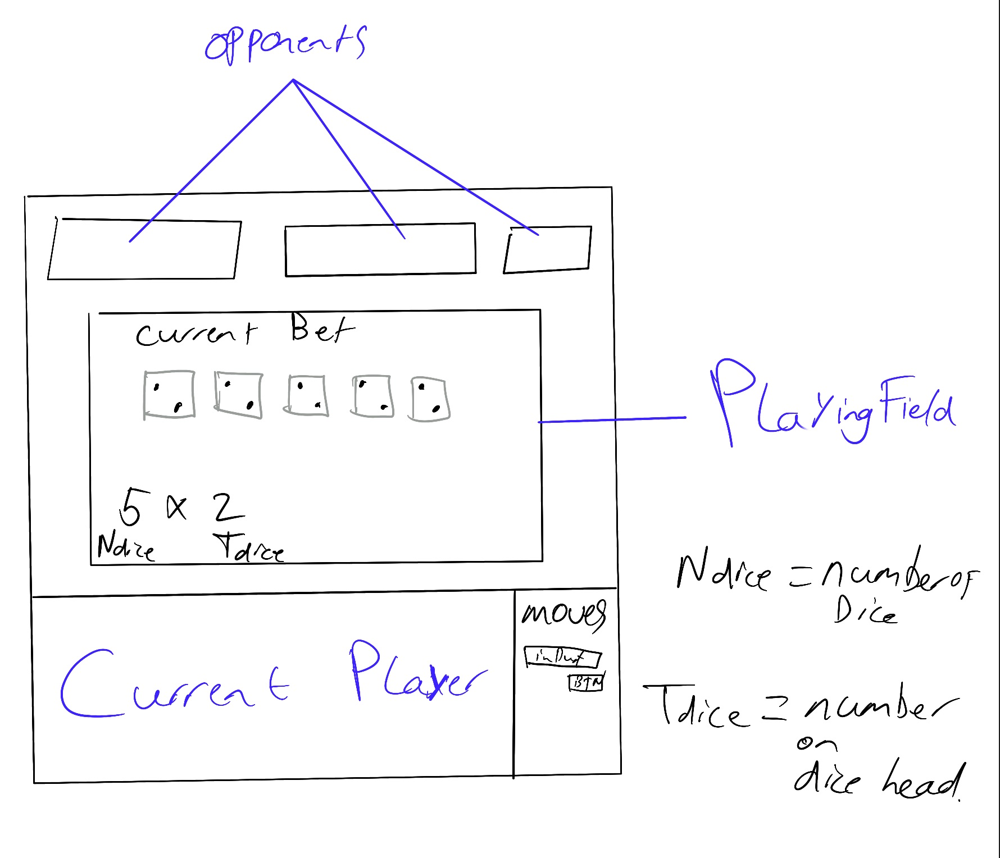
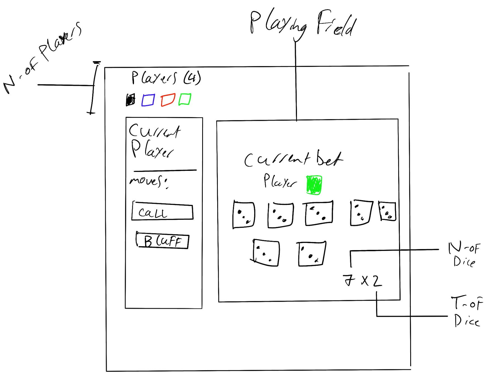
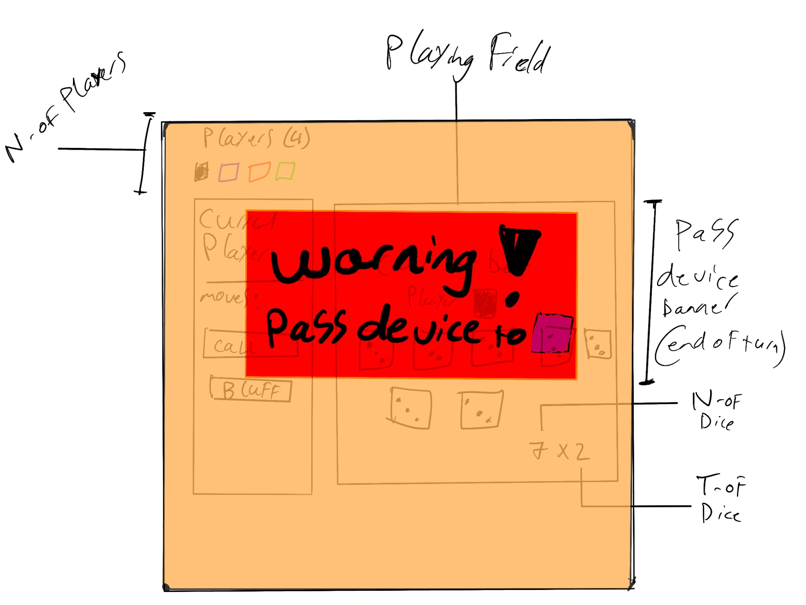
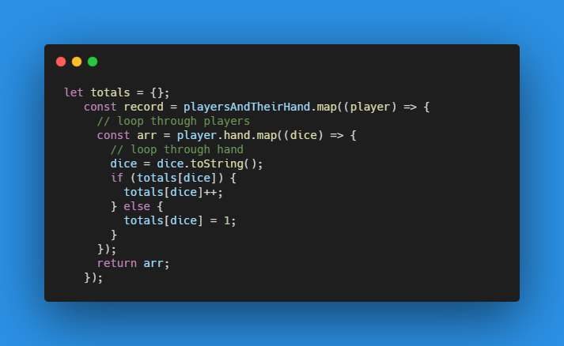
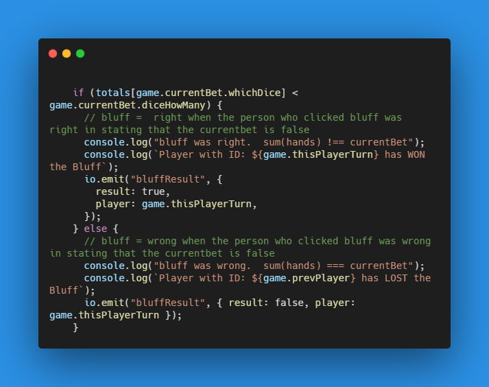

# Main Assignment

[Live Demo](https://rtw2021.herokuapp.com)

## Visual demo

## Case

---

_Concept_

I want to recreate [this](https://nl.wikipedia.org/wiki/Dudo) game of dice. It will be similar to how its played in the movie [Pirates of the Carribean: Dead Man's Chest](https://www.youtube.com/watch?v=5crxHhe5b7w).

_Start of the game_

- All players start with 5 dice
- All players "shuffle" their dice so that they are random. Players can't see other peoples dice.
- 1 player starts the game (pre round highest dice throw?)
- The playing field is the collection of all dices of all players

_Steps of the game_

1. Player 1 Starts the game by stating a dicehead and the number of times he thinks it is on the playing field.

2. Next players selects CALL or BLUFF and performs the corresponding decision.

_Rules of the game_

1. When its a players turn he can state a dice head (1 - 6) and the number of times that dice head is on the field with all players's dice combined. For example four 3's or two 6's

2. The amount of diceheads can only be higher than the previous players CALL. For example after two 3's if the next player selects "CALL" any dicehead can be selected but the number of dice (two in this case) must be higher. So three 3's is valid, one 6 is invalid.

3. When a player selects BLUFF all players will show their diceheads and they are counted. If the previous player was right OR the number of corresponding diceheads is LOWER than what the previous player stated the previous player was right. Therefore the player who selected BLUFF will get a 🍺. If the previous player was wrong in stating the correct number of diceheads on the field ( actual number is HIGHER) the previous player gets a 🍺.

4. Repeat step 1 - 3 until players call it a day.

5. Count the number of 🍺 behind peoples name. the person with the least amount of 🍺 has won the game.

6. When the game ends the players will see who won the game.

_Referee_

The referee is a piece of software on the server side of this application.

- Makes decisions based on the actions of players.

- Keeps track of turns

- Selects the next player

- Counts the number of dice and diceheads and states if player were actually bluffing or not bluffing.

- Keeps track of the score.

## Data Lifecycle Diagram

This is what the main forces that influence the data are, who controlls them and where they are located.

## Real Time Events

|             Event             |                                                                       Description |
| :---------------------------: | --------------------------------------------------------------------------------: |
|     bluffResult {result}      |                           handle The result of the emitted Bluff by another user. |
|        newHand {hand}         |                                      Handle the new hand of dice for this player. |
| nextPlayerTurn {nextPlayerID} |                                                        Handle the change of turn. |
|  startGame {thisPlayerTurn}   |                 Start the game, send along the ID of the player who's turn it is. |
|          playerReady          |                      Tell the server that this player is ready to start the game. |
|      playingFieldUpdate       | Update the currentBet element on the client that shows the last made bet of dice. |
|         confirmBluff          |                                              Handle the bluff done by the client. |
|          confirmCall          |                                               Handle the call made by the client. |
|  socketDisconnect {playerID}  |                  Send msg to other players that this specific user left the game. |

# The Game Object / Referee

This Object {} lives on the server and keeps track off all important information regarding the game so that it is not possible to cheat.

Below is a snapshot of the game. In this scenario 2 players played a total of 2 turns with 1 call and 1 bluff

# Assignments

During the first assignment we worked in a group. Together we made the basic-chat app with real time functionality. [Repository](https://github.com/stanRepo/real-time-web-2021/tree/TEAM-CHAT-APP)

### Concepts

Since I had chosen the this game as a main concept my Lecturer Lukas told me to create 3 variations of the game. The variations should be about how the user interacts with the game.

---

_Concept 1_

Every player plays on his own device connected to the "game" server by sockets.

Concept Drawing:

---

_Concept 2_

Every player is connected to the same device and plays the game on this single device. This concept is based more around the idea of coming together and play a board game. A form of socializing. Adding a layer of playfullness to a different (related / non-related) social activity. Players are invited to use this game as a "party" game.

In this concept the player has the ability to select multiple players before the game starts. Therefore multiple players can play from the same device. After the turn ends the player should display a "warning, pass the device to player X" banner. To prevent the previous player from seeing the "player X's" diceheads.

Extra:

- This specific design lends itself good for display on a external screen. For instance screen mirroring with the Google Chromecast.

---

_Concept 3_

This concept is focussed around offline support. The "Wordfeud"-like version. Players can disconnect their socket and close of their browser and the server will still remember which player comes from which device. Players get a message when its their turn or if the results of their Call / Bluff actions are ready.

---

# Coding Style

For Coding style I took a look at the [Google JavaScript Style Guide](https://google.github.io/styleguide/jsguide.html).

- When I replaced the require statements on my server-side code I noticed that socket.io doesn't support the export syntax required for this to work. So to keep my way of importing neat I chose to stick with `const x = require('/path/to/code')`

# Database

For this project I wanted to use _Firebase_ to store player moves and game information.
At the time of writing, this is not implemented yet. Instead I store the data in a variable `let game`.

Example game object right before the end of a game with 2 players.

# Log Examples

_Handling bluffResults_

At multiple points during the game, the turn player can select Bluff. Now the referee/server needs to check whether the sum of all hands matches the currentBet and respond to that. The image below shows a log that visualizes how this is assessed:

The code example below shows how this is handled:

1. First I sum up the diceheads in an {}

2. Then I use an `if else` statement to send the correct information to the user

